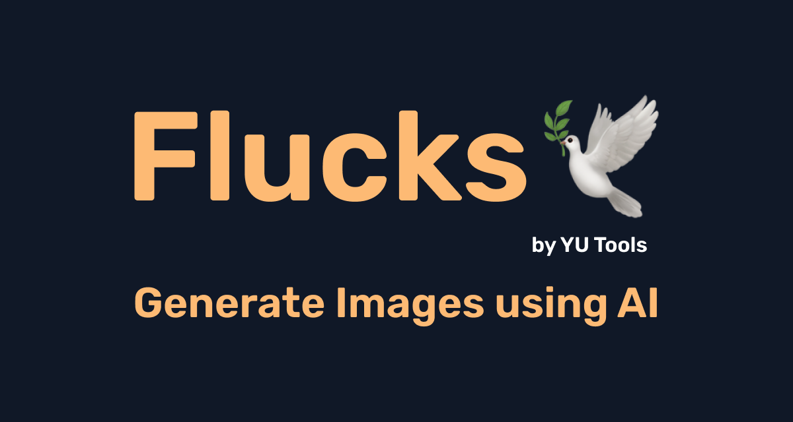

# Flucks 🕊️



> لا يدخلُ الجنةَ مَنْ كان في قلبِهِ مِثقالُ ذرَّةٍ من كِبرٍ ، قِيلَ : إنَّ الرجُلَ يُحبُّ أنْ يكونَ ثوبُهُ حسنًا ، ونعلُهُ حسنةً ، قال : **إنَّ اللهَ جميلٌ يُحبُّ الجمالَ** ، الكِبرُ بطَرُ الحقِّ ، و غمْطُ الناسِ
>
> الراوي : عبدالله بن مسعود وعبدالله بن سلام | المحدث : الألباني | المصدر : صحيح الجامع | الصفحة أو الرقم : 7674 | خلاصة حكم المحدث : صحيح | [المصدر](https://dorar.net/hadith/sharh/26239)

Flucks is an innovative image generation tool that helps you explore the beauty of creation through technology. Transform your ideas into visual representations with the power of AI, guided by ethical principles.

## ⚠️ User Responsibility and Liability

By using Flucks, you explicitly agree to the following:

1. You are solely responsible for any content you generate using this tool.
2. Any moral or ethical transgressions resulting from the misuse of this tool are your responsibility alone.
3. The creators and maintainers of Flucks bear no responsibility or liability for any inappropriate, illegal, or unethical content created by users.
4. You acknowledge that protections have been put in place, and you have been warned about potential misuse.
5. This tool is intended for positive and beneficial use only. Any other use is strictly prohibited.

**By using Flucks, you absolve the creators of this tool from any moral or religious responsibility related to your use of the service.**

## ✨ Features

- 🖼️ Create high-quality 1440x1440 images
- 🚀 Utilizing advanced FLUX.1-schnell model technology
- 🌈 User-friendly interface promoting ease of use
- 🔮 Convert written descriptions into visual art

## 🚀 Getting Started

1. Clone the repository:

   ```
   git clone https://github.com/yutools/flucks.git
   cd flucks
   ```

2. Install necessary components:

   ```bash
   pnpm install
   ```

3. Prepare your environment:

   ```bash
   cp .env.example .env
   ```

4. Obtain your Together API key:

   - Visit [Together.ai](https://together.ai)
   - Create an account
   - Retrieve your API key from the dashboard

5. Input your API key in the `.env` file:

   ```
   TOGETHER_API_KEY=your_api_key_here
   ```

6. Start the application:

   ```bash
   pnpm run dev
   ```

7. Open your preferred browser and go to `http://localhost:5173`

## 🖥️ The Technology

Flucks uses the FLUX model to transform your descriptions into images, showcasing the marvels of modern technology:

```javascript
import { json } from '@sveltejs/kit';
import { together } from '../../lib/together';

export async function POST({ request, cookies }) {
	const { prompt } = await request.json();

	const response = await together.images.create({
		model: 'black-forest-labs/FLUX.1-schnell-Free',
		prompt: prompt,
		width: 1440,
		height: 1440,
		steps: 4,
		n: 1
	});

	return json(response.data[0]);
}
```

## 🎨 Create with Purpose

1. Reflect on an inspiring concept
2. Describe it thoughtfully in the Flucks interface
3. Generate the image and witness the manifestation of your idea
4. Share your creation to inspire and benefit others

## 🤝 Contribute to Knowledge

If you have ideas to improve Flucks and benefit more people, please share them! Open an issue or submit a pull request, and let's work together to enhance this tool for the greater good.

## 📜 License

Flucks is MIT licensed, encouraging open sharing of knowledge and collaboration. However, please note that the license explicitly disclaims all liability for any misuse or unintended consequences of using this software. See the LICENSE file for full details.

---

Developed with intention by the YU Tools Team

Use Flucks responsibly to create beauty and spread beneficial knowledge. 🌟

> It is on you if you misuse this project. YU Tools does not take any responsibility for misuse!
